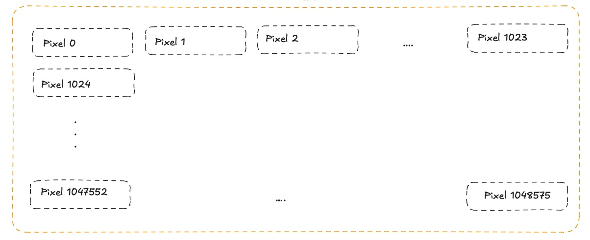
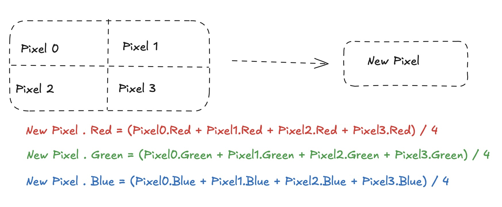

## Background

You have just started working in the IT department of a large marketing company (York Digital Marketing).  They have a team of photographers
which will take a series of pictures for their current project and then manipulate them in their editing software.  Once 
the project is complete, they will hand you a folder of their photos for safe keeping.  

Due to the quantity of photos the multiple hard drives on your main server are now becoming full, and you must find a 
more efficient way of storing the images.  You cannot unfortunately copy the files into some cheap external storage as 
the photographers will often need to re-visit their previous projects.

In the past the company tried compressing the images using a 3rd party library.  When the images were decompressed however
some of their quality was lost.   The photographers were very angry at this and complained to the management.  This is the reason
why your predecessor no longer works at the company and external libraries (such as zip) are banned.

## Challenge
Tonight's task is to find a method of taking a FOLDER of images and reducing the space they take up.  The rules are simple

* No 3rd party compression library can be used.
* There must be a way of restoring all the images to exactly their original form.  i.e. No quality can be lost.
* All images must be restored.  Even if an image looks rubbish to you, it is very important to the photographer!
* You should aim to reduce the size of the folder as much as possible.
* A fast compression speed is not a requirement.   The folder should be decompressed in under 5 minutes however.
* The use of AI is discouraged, as the photographers fear it will take their jobs.

## File Format

The company has decided to take all the images in SIF (Super Image Format).  The images are always 1024 x 1024 pixels.  
The first 1024 pixels in the file represent the first line.  The 2nd 1024 pixels the 2nd line and so on.

### Figure 1 - File Layout

Each pixel is represented by 3 bytes (Red, Green, and Blue).

For example, if the image begins with a Blue, a Red and then a White pixel then file would start with

## Resources

A typical folder of images can be found in GitHub at https://github.com/YorkCodeDojo/OutOfSpace/tree/main/Images

This GitHub repo also contains an application for viewing SIF files.
* https://github.com/YorkCodeDojo/OutOfSpace/tree/main/ViewImage  (requires dotnet 9)

and there is also an online website
* https://yorkcodedo-viewsif.azurewebsites.net

Alternatively, jpeg previews of the sample sif files can be found in https://github.com/YorkCodeDojo/OutOfSpace/tree/main/Previews

## Hints to get started

* Remember the end goal is to reduce the size of the entire FOLDER.
* Sometimes the photographer forgets to remove the lens cap from the camera.
* One of the cameras has a dodgy button and has been known to take multiple identical photographs 

## Appendix A - Bytes

* Bytes are 8 bits wide (00000000 through 11111111).
* This gives a range of 256 (0 to 255) possible values.
* As 256 is 16 * 16 they can also be represented by 2 hexadecimal values (00 to FF)
* Images often have a colour depth of 24 bits or 3 bytes per pixel.  
* One byte to represent the amount of Red, one for Green and one for Blue.
* This gives a range of 16,777,216 possible colours (256^3)

### For example
* A red pixel would be represented by the bytes 255,0,0 or FF,00,00
* A white pixel would be represented by the bytes 255,255,255 or FF,FF,FF
* A black pixel would be represented by the bytes 0,0,0 or 00,00,00
* A light yellow pixel would be represented by the bytes 255,255,204 or FF,FF,CC

## Appendix B - Shrinking Images

When the photo editing software shrinks the images it does it by replacing every 2x2 block of pixels with
a single pixel.  The colour of the pixel is the average of the colour of the original 4 pixels.

